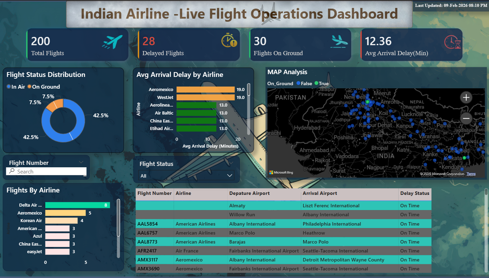

# ✈️ Indian Airline – Live Flight Operations Dashboard

## 📌 Project Overview
This project is an interactive Power BI dashboard that analyzes live flight operations and arrival delays.  
It provides real-time monitoring of flights, airline performance, and operational insights.

---

## 🎯 Objectives
- Track total flights and delayed flights
- Analyze average arrival delay by airline
- Monitor flight status (In Air / On Ground)
- Visualize live flight locations using map
- Enable filtering using interactive slicers

---

## 📊 Dashboard Features
✔ KPI Cards (Total Flights, Delayed Flights, Avg Delay)  
✔ Flight Status Distribution Chart  
✔ Airline Delay Comparison  
✔ Live Flight Map Visualization  
✔ Detailed Flight Table  
✔ Interactive Filters (Airline, Status, Airports)

---

## 🛠 Tools & Technologies Used
- Microsoft Power BI
- Power Query (Data Cleaning)
- DAX (Data Analysis Expressions)
- Data Modeling
- Bing Maps Integration

---

## 🗂 Dataset Description
The project uses:
- Live flight dataset (Flight status, Timestamp, Location)
- Flight details dataset (Airline, Airports, Arrival Delay)
- Dimension tables (Airline & Airport information)

---

## 📷 Dashboard Preview
(Add your screenshot below)

---

## 🚀 Key Insights
- Majority of flights are currently in air
- Only a small percentage of flights are delayed
- Certain airlines show higher average arrival delays
- Interactive filters allow detailed operational analysis

---

## 🔮 Future Improvements
- Add weather impact analysis
- Include historical trend analysis
- Implement real-time alert system

---

## 📎 Project Status
Completed and published as part of my data analytics portfolio.

---

## 🙌 Author
Your Name  
Aspiring Data Analyst
